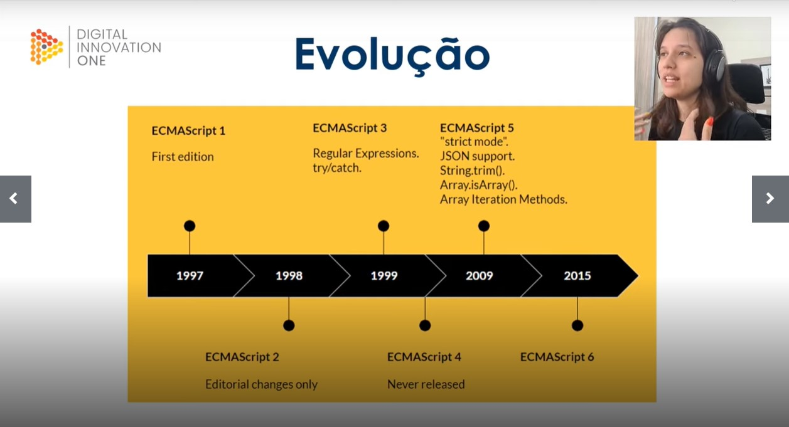
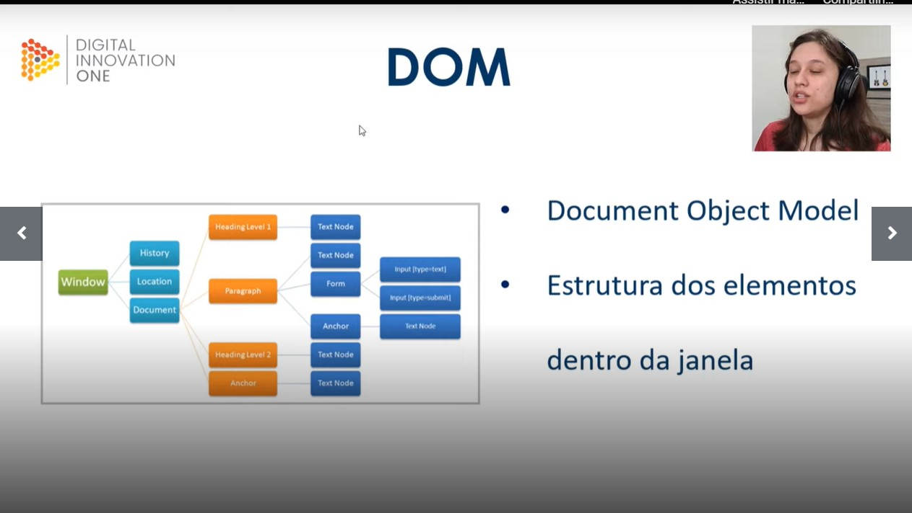
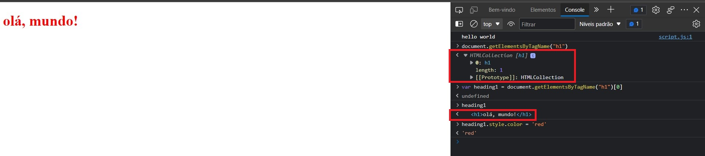

# Anotações de Aula 

# Javascript

**### O que é o Javascript**
linguagem interpretada - ela está sendo rodada em tempo real e disponibilizado instantaneamente nao precisa de um compilador para interpretar e mostrar o resultado

baseada em prototipos - um conjunto de estruturas e funcoes

multiparadigma - escolher se quer escolher com orientacao a objetos, programação funcional ou programacao estruturada. se adapta conforme a necessidade.

pode ser utilizada em aplicações web client-side - é a linguagem que borwser entendem, interacao com o usuario. até mesmo complexas

segue padrao ECMAScript - é um padrao p varias linguagens, um conjunto de normas e funcoes

**### Evolução do Javascript**

a mais importante foi a ECMAScript 6 - 2015 pois trouxe bastante função para facilitar a programação

todo ano temos atualização mas as mais impactantes foram as de 2015.

dica: fazer sempre pesquisa sobre as atualizações do ECMAScript

O Java pode ser usado nao somente em WEB mas também nos celulares, smartwatches, fazer games, coisas ligadas a Internet das Coisas e APIs que podem ser usadas na Alexa por exemplo.

**### Recursos básicos da linguagem**

**Comentario**
para comentar uma linha é necessário somente colocar duas barra nas frente

exemplo:
// var y = 0;

para comentar várias linhas usamos o simbolo de barra + asterisco e necessário fechar esse comando ao final do texto a ser comentado.

exemplo:
/* var y = 0;
var x = 0 */

**Variavel**
(var) é um valor pre determinado mas que pode ser utilizada para obter um novo valor

exemplo:

var preco = 2 -> significa que o valor da variavel preço é sempre 2
var desconto - 0.2

preco = preco - desconto -> nessa formula a gente vai acabar obtendo um novo preço considerando que existe uma nova variavel que é o desconto

**Constante**
(const) que deve sempre ser escrita em letras maiusculas e essa sim nao pode ser manipulada, nao pode ser usada no exemplo anterior

const PRECO = 2;

PRECO = PRECO - desconto -> essa operação nao pode ser feita porque a constante nao pode ser alterada

correto é criar uma nova variavel para realizar essa operacao

exemplo:

const PRECO = 2;
var desconto - 0.2;
var total = PRECO - desconto;

**Função**
(function) sempre deve ter um nome e é uma programação de algo que deve ser executado

estrutura basica:

function soma() {
}

dentro dos parenteses eu posso declarar parametros

exemplo:
function soma(a,b) {
}
essa funcao vai somar os numeros a e b

apos esse comando temos algumas opcoes:

escrever return para utilizar esse resultado em alguma nova funcao
escrever console.log para testar essa funcao e verificar se está tudo certo. usado muito para ver os erros. pode ser visualizado de varias maneiras, com mensagem, sem mensagem, em tabela, etc...

exemplo:
function soma(a,b) {
console.log(a + b);
}

ou
function soma(a,b) {
return a + b;
}

até aqui só definimos a funcao
para executar uma funcao eu preciso chamar ela e indicar os parametros

exemplo:
soma(3, 5);

sendo 3 o parametro "a" e 5 o parametro "b"

**Array**
é uma lista

**### Console**

podemos acessar o console disponivel no proprio google chrome
abrir a pagina inicial do google
clicar com o botao direito na tela e acessar INSPECIONAR
uma das abas se chama CONSOLE
nesse console é possivel testar as funcoes criadas
muito usado para desenvolvimento de pagina WEB

outra forma é usar o NodeJS
apos instalado, acesse no Visual Studio Code a função TERMINAL
vá digitando cd + tab para acessar a pasta onde está o arquivo .js
digite node + nome do arquivo e aperte enter
o arquivo javascript será executado e oresultado esperado vai aparecer

**### Javascript em uma pagina da web**

é boa pratica criar uma pasta chamada assets para separar todas as estruturas auxiliares de um projeto html, seja css ou javascript

é uma boa pratica colocar o script de javascript no final da pagina antes do encerramento da tag HTML pois o site é lido de cima para baixo e alguns script possuem um alto processamento e podem deixar o site lento para carregar.

para importar o javascript em uma pagina, colocaro comando abaixo antes do final da tag html:

**Interagir comos elementos do DOM**
DOM = Document Objet Model e se refere a estrutura dos elementos dentro da janela

é possivel alterar a formatação da página usando o DOM e usando alguns comandos do javascript

exemplo:
na pagina index.html, acessar o inspecionar e no console fazer os passos abaixo:

document.getElementsByTagName("h1") + enter

essa query mostrou que temos somente 1 h1 e por isso retornou o valor 0 conforme assinalado em vermelho

vamos agora definir uma variavel chamada heading1 e seu resultado será essa busca que fizemos direcionada para o elemento que achamos que é zero apertar enter

var heading1 = document.getElementsByTagName("h1")[0]

agora ao digitar heading1 no console, vai mostrar como resultado o titulo do index.html, conforme assinalado em vermelho

agora podemos mandar um comando para mudar a cor desse elemento digitando o comando abaixo:

heading1.style.color = 'red'

pronto. a cor na pagina é automaticamente alterada.

**### Atividade Prática**
comando onclick ativa a funcao do meu script

**### Frameworks e mercado de trabalho**
Frameworks mais populares
VueJS
Angular
React
JQuery 

Frameworks e bibliotecas
é um recurso que traz mais rapidez na hora de desenvolver algo em javascript

sites que ajudam bastante no dia a dia
MDN - mozilla
W3C
Stack overflow
github
dio
youtube

