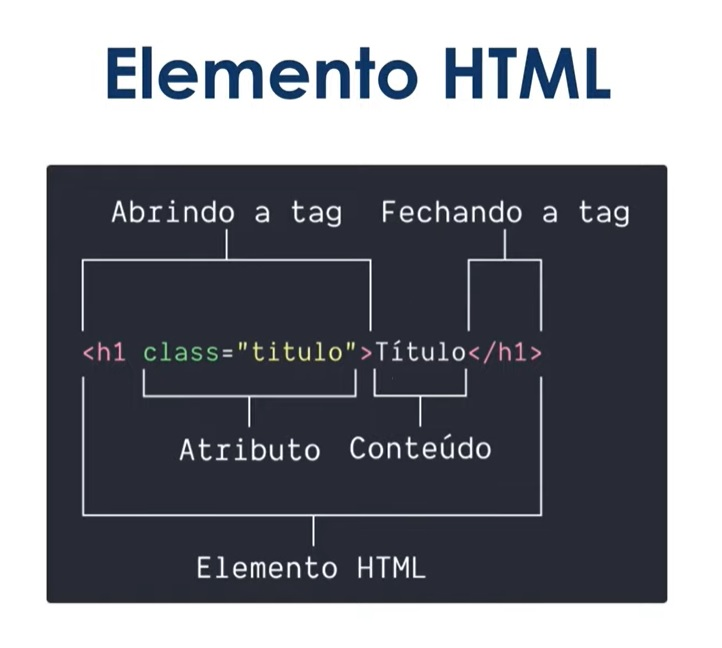
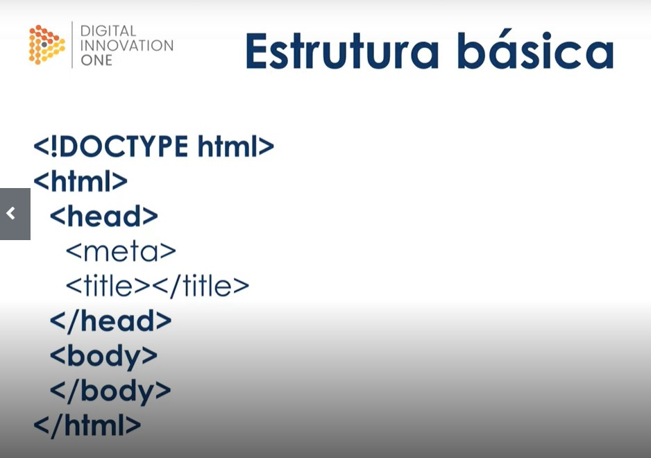

# Anotações de Aula 

# HTML 5

### Historia e estrutura basica

**HTML5**

Definição e estrutura básica

Em 1991 Tim Berners-Lee criou essa linguagem de marcação para melhorar a comunicação entre ele e seus colegas de trabalho no CERN, desde então já surgiram 5 versões e o HTML se tornou a base da web.

Com o HTML definimos o significado e a estrutura do conteúdo da web e, além de texto, nossas páginas precisam de imagens, vídeos e vários outros formatos e para isso temos os elementos HTML.

Um elemento HTML é formado pela tag de abertura e seus atributos, o conteúdo e uma tag de fechamento. E mais a frente veremos que existem elementos que não tem tag de fechamento.

 

Com esses elementos podemos agrupar tipos de conteúdo, alterar tamanho e forma de fontes e adicionar diferentes mídias ao nossa página na web.

E agora podemos ver como é a estrutura básica de um arquivo HTML.

 

## Exercicio Pratico
Criada uma pagina chamada index.html para verificar os conceitos aplicados

- TAG DOCTYPE

 A primeira linha do documento deve ser o !DOCTYPE html, apesar de parecer um elemento HTML ela apenas diz ao navegador que ele está lidando com um arquivo do tipo HTML5. Os elementos HTML vem logo abaixo.

- TAG HTML

A tag html é a raiz do seu documento, todos os elementos HTML devem estar dentro dela. E nela nós informamos ao navegador qual é o idioma desse nosso documento, através do atributo lang, para o português brasileiro usamos pt-BR.

- TAG HEAD

A tag head contém elementos que serão lidos pelo navegador, como os metadados - um exemplo é o charset, que é a codificação de caracteres e a mais comum é a UTF-8, o JavaScript com a tag script, o CSS através das tags style e link - veremos a diferença quando falarmos sobre CSS - e o título da página com a tag title.

- TAG BODY

E dentro da tag body colocamos todo o conteúdo visível ao usuário: textos, imagens, vídeos.

# Semântica
Durante muitos anos o elemento padrão no HTML era a div, construíamos nosso conteúdo todo baseado nela, e assim nascia a sopa de divs.

Mas em 2014 saiu a quinta versão do HTML, e com ela vieram vários mudanças importantes, como performance e acessibilidade, mas nesse curso introdutório vamos focar na semântica.

A semântica nos permite descrever mais precisamente o nosso conteúdo, agora um bloco de texto não é apenas uma div, agora é um article e tem mais significado assim. E temos vários elementos para ressignificar as divs:

- Elemento section

Representa uma seção genérica de conteúdo quando não houver um elemento mais específico para isso.

- Elemento header

É o cabeçalho da página ou de uma seção da página e normalmente contém logotipos, menus, campos de busca.

- Elemento article

Representa um conteúdo independente e de maior relevância dentro de uma página, como um post de blog, uma notícia em uma barra lateral ou um bloco de comentários. Um article pode conter outros elementos, como header, cabeçalhos, parágrafos e imagens.

- Elemento aside

É uma seção que engloba conteúdos relacionados ao conteúdo principal, como artigos relacionados, biografia do autor e publicidade. Normalmente são representadas como barras laterais.

- Elemento footer

Esse elemento representa o rodapé do conteúdo ou de parte dele, pois ele é aceito dentro de vários elementos, como article e section e até do body. Exemplos de conteúdo de um footer são informações de autor e links relacionados.

- Elementos h1 até h6

Eles não foram criados na versão 5 do HTML e nem são específicos para semântica, mas servem para esse propósito. São utilizados para marcar a importância dos títulos, sendo h1 o mais importante e h6 o menos. Uma dica: use apenas um h1 por página, pois ele representa o objetivo da sua página.

## Exercicio Pratico
Adicionar essa nova estrutura na pagina index.html ja criada

## Textos e links
- Elemento p

O p representa um parágrafo, mas ele não suporta apenas texto, podemos adicionar imagens, código, vídeos e vários outros tipos de conteúdo dentro dele.

- Elemento a

Um outro elemento interessante e extremamente necessário na web é o a que significa anchor/âncora, ele representa um hyperlink, é ele que interliga vários conteúdos e páginas na web.

O elemento a tem vários atributos, mas vamos focar em dois, o href e o target.

O href representa o hyperlink para onde sua âncora aponta, pode ser uma página do seu ou de outro site, um e-mail e até mesmo um telefone, os dois últimos precisam dos prefixos mailto: e tel:, respectivamente.

O target neste momento vai servir para nos ajudar a abrir nossos links em outra aba do navegador usando o valor _blank.

## Exercicio Prático
Adicionar um texto fictício na pagina index.html, inserir o elemento p com um texto qualquer e inserir dois elementos a colocando um link para outra página e um para nosso e-mail.

## Imagens
A web também é feita de imagens e para representá-las temos o elemento img, ele é um daqueles elementos sem tag de fechamento.

O elemento img é bem simples, contendo apenas 2 atributos próprios, o src e o alt.

O src é obrigatório e guarda o caminho para a imagem que você quer mostrar na página.

O alt não é obrigatório mas é altamente recomendado por melhorar a acessibilidade, ele mostra a descrição da imagem caso ela não carregue e leitores de tela usam esse atributo para descrever a imagem para o usuário saber o que ela significa.

## Exercicio Pratico
Vamos adicionar na nossa pagina index.html uma imagem ao cabeçalho e uma imagem a postagem.

## Listas
Os últimos elementos que veremos neste módulo são os relacionados a listas: ul, ol e li.

Listas servem para agrupar uma coleção de itens, como uma lista de ingredientes ou, como será no nosso caso, uma lista com contatos.

O elemento ul cria uma lista não ordenada, onde a ordem dos elementos não é importante, e é representada com pontos, círculos ou quadrados.

O elemento ol serve para criar lista ordenadas, nessas a ordem importa, portanto elas são representadas com números, algarismos romanos ou letras.

E o elemento li é um item dentro de uma dessas listas. Um li pode conter vários tipos de conteúdos, como parágrafos, imagens e até outras listas.

## Exercicio Pratico
Vamos adicionar na nossa pagina index.html, no nosso rodapé, uma lista de contatos nao ordenado e uma lista de contatos ordenado.

# CSS3

## Definição e seletores
Após a criação do HTML a necessidade de formatar as páginas ficou evidente, assim, em 1996, foi criada a linguagem de estilo que conhecemos por CSS.

A sintaxe é bem simples e pode ser explicada com a frase "você cria regras de estilo para elementos ou grupos de elementos".

Vamos usar um elemento HTML que vimos anteriormente, a âncora a, para exemplificar.

Uma regra CSS é representada por um seletor ou um grupo de seletores, no nosso caso é o a, então dentro de um par de chaves adicionamos as declarações, no exemplo acima estamos alterando cor e tamanho da fonte dessa âncora, as declarações são formadas por uma propriedade e um valor.

Percebam que podemos colocar vários seletores em uma regra separando-os por vírgula.

E há um último detalhe nesse exemplo: a pseudo-classe. Elementos HTML sofrem alterações causadas pela interação do usuário, como mover o mouse por cima ou clicar nesse elemento.

O a:hover do exemplo significa que a âncora também terá essa aparência quando o usuário passar o mouse por cima de um hyperlink.

## ID x Classe
No exemplo anterior criamos uma regra que altera um elemento HTML diretamente, mas isso significa que todos os elementos a ficarão com aquela aparência, e normalmente temos sites mais complexos que precisam de várias regras diferentes para elementos iguais.

Para ficar mais tangível vamos relembrar um pouco o site que começamos a fazer no módulo passado, ele tinha vários elementos header, mas não vamos querer que o header principal tenha a mesma formatação que o header de uma postagem, é aí que entram os IDs e Classes.

O seletor que vimos no primeiro exemplo é um seletor de tipo, pois ele representa um elemento HTML, e com IDs e Classes podemos representar qualquer tipo de elemento mas há algumas diferenças entre eles:

ID: é representado pelo símbolo # (hash) seguido de um nome para esse ID.

Classe: a classe é representada de forma parecida do ID, mas é precedida por um ponto em vez do hash.

E a diferença mais importante entre eles é a forma como devem ser usados: o ID só pode ser usado uma vez em uma página HTML enquanto a classe não tem restrições.

## Exercício Pratico
Vamos adicionar algumas classes no nosso site e alterar alguns elementos, mas antes precisamos adicionar um arquivo CSS a nossa página.

No módulo de HTML descobrimos que podemos adicionar CSS de duas formas, com o elemento style, e assim suas regras ficarão no arquivo HTML, ou podemos criar um arquivo CSS e adicioná-lo na página através do elemento link, e é essa forma que usaremos.

Crie um elemento link dentro do head do seu arquivo e adicione os atributos rel="stylesheet" e href="style.css", o rel denota o tipo de arquivo que estamos incluindo na página e o href é o caminho para o arquivo. E na mesma pasta do arquivo HTML crie um arquivo chamado style.css.

exemplo:
 <link rel="stylesheet" href="assets/css/style.css">
 assets e css sao pastas que devem ser localizadas no mesmo local do index.html

Agora sim vamos ao CSS, adicione um ID #title ao h1 da página, pois queremos que ele seja único, e depois adicione as classes .subtitle e .post_title ao h2 e h3, respectivamente.

No arquivo CSS vamos mudar a cor desses três títulos, e depois alterar o tamanho da fonte do título da postagem.

## Box-model
Quando estamos criando o layout de um site o navegador representa cada elemento HTML  como uma caixa retangular, isso é o box-model. E com CSS nós alteramos a aparência dessa caixa (largura, altura, cor de fundo, etc.). Essa caixa é composta por 4 áreas: o conteúdo, o padding, a borda e a margem.

As margens (margin) são espaçamentos entre elementos;
As bordas (border) ;
O padding é um espaçamento entre as bordas e o conteúdo, a diferença para as margens é que declarações de imagem de fundo funcionam nele;
O conteúdo (content) é o que o seu bloco representa, um texto, uma imagem, um vídeo;
 

## Exercício Pratico
Para enxergamos o box-model vamos adicionar cores e bordas a alguns elementos.

Primeiro adicionaremos uma cor de fundo para a visualização ficar mais fácil, usaremos a propriedade background com o valor #fcfcfc no elemento body.

Depois vamos adicionar uma classe ao elemento article, pode ser .post, e então vamos colocar a cor branca de fundo com a propriedade background e o valor #FFF. Agora conseguimos enxergar o content do box-model.

Vamos adicionar um padding de 10 pixels neste mesmo article. Perceberam o espaçamento que surgiu em volta do nosso conteúdo?

Agora adicionamos um borda mais escura a ele com a propriedade border. Vou falar mais detalhadamente sobre border mais a frente, mas por enquanto vamos deixar essa borda com 3 pixels de largura, o contorno sólido e a cor azul.

E por último vamos adicionar uma margem do lado de fora do post com a propriedade margin e o valor 10 pixels.

E agora inspecionando o nosso elemento conseguimos todas aquelas camadas citadas antes: o conteúdo em azul, o padding em verde, as bordas em marrom e as margens em laranja.

E já que começamos a falar sobre bordas e cor de fundo, no próximo vídeo vamos nos aprofundar nessas propriedades.

## Estilizando elementos
Agora que entendemos o box-model podemos focar em deixar nosso site mais bonito, então vamos repassar pelas propriedades já citadas:

## Padding e Margin
Anteriormente usamos o padding e o margin da forma mais básica, com apenas um valor, mas eles são mais poderosos que isso. Se quisermos atribuir tamanhos diferentes para cada lado do box nós podemos, e vamos ver três formas de fazer isso.

A primeira é colocando um valor para as partes superior e inferior e depois para os lados esquerdo e direito.

O valor de 10 pixels se refere ao eixo Y, ou partes superior e inferior, e os 5 pixels se referem aos lados esquerdo e direito.

A segunda forma é dando valores para cada lado do box.

Então começamos pelo topo com 15 pixels, passamos o lado direito com 10 pixels, depois para a parte inferior com 5 pixels e por último o lado esquerdo com 0, e sempre nessa ordem.

Uma boa dica também é que quando o valor for 0 não precisamos não precisamos colocar a unidade.

A terceira forma é com as propriedades específicas para cada lado, até agora tínhamos visto atalhos para essas propriedades.

Essa opção é mais usada quando temos o mesmo valor para 3 lados, e o quarto precisa ter um valor diferente, então usamos o padding com apenas um valor e uma dessas opções para representar o lado diferente.

## Background
A propriedade background também é um atalho para várias propriedades, mas isso vocês podem absorver aos poucos, e uma boa opção de leitura é a documentação do MDN.

Por enquanto veremos apenas como mudar a cor de fundo.

E aqui temos 3 formas de colocar uma cor de fundo, e ainda existem outras.

A primeira é pelo nome da cor em inglês, a segunda é pelo código hexadecimal e a terceira é usando apenas o atalho background.

## Border
Vimos que a propriedade border pode ter 3 valores: a largura, a cor e o estilo, mas existem algumas particularidades nisso.

A largura pode ser usada com várias unidades, como px, em e mm. A cor pode ser atribuída pelo nome ou por um código hexadecimal, assim como fizemos com o background, e o estilo é representada por palavras-chave, vamos ver algumas delas:

solid: mostra uma borda simples e reta;

dotted: são bolinhas com um pequeno espaçamento entre elas;

dashed: forma uma linha tracejada.

E aproveitando que mostrei esse código temos que falar sobre como separar a estilização dos lados de uma borda.

E se você não quiser usar a propriedade border existem as propriedade específicas para cada aspecto de uma borda, são elas border-width para a largura, border-color para a cor e border-style para o estilo.

Aqui temos o mesmo código anterior de duas formas diferentes, a primeira com o atalho border e a segunda com cada propriedade específica.

E depois disso podemos juntar os lados com os aspectos de uma borda e criar uma regra mais específica ainda.

## Border-radius

E a última propriedade é o border-radius, ele permite arredondar os cantos de um elemento. Podemos usar várias unidades, mas as mais comuns são os pixels e a porcentagem.

Colocando apenas um valor mudamos todos os cantos do elemento, mas seguindo aquela mesma ordem que vimos no padding e margin - topo, direita, inferior e esquerda -  conseguimos alterar cada canto separadamente.

 
## Exercício Pratico
Neste exercício vamos deixar o nosso site um pouco mais bonito usando as propriedades que acabamos de ver.

Vamos aumentar o padding para 15 pixels e colocar uma margem de também de 15 pixels só na parte de baixo do post.

Quando olhamos para os textos percebemos que os espaçamentos estão diferentes do restante do post, então vamos padronizar isso.

No título do post vamos retirar todas as margens para depois colocar apenas uma margem inferior de 15 pixels. E no corpo do post precisamos adicionar uma classe e remover todas as margens para depois adicionar uma margem superior de 15 pixels.

Podemos manter o background branco, mas vamos diminuir a largura das bordas para 2 pixels e mudar a cor para a mesma do texto - #505050 - e por último adicionaremos um border-radius, 5 pixels são suficientes. Podemos adicionar esse mesmo de valor de border-radius na imagem, para isso vamos acrescentar uma class a imagem antes.

## Estilizando textos
Já sabemos que podemos mudar cor e tamanho de algumas fontes, e agora vamos nos aprofundar nisso.

## font-family
Com o font-family podemos alterar a fonte dos nossos textos, como uma fonte da internet ou uma que esteja instalada no nosso computador, mas vamos nos ater às fontes seguras, chamadas de web safe fonts.

Essas fontes são chamadas assim pois são encontradas em quases todos os sistemas e podem ser usadas sem preocupação.

Podemos usar uma virgula apos a primeira fonte como forma de definir uma fonte secundária caso a primeira fonte falhe.

## font-size
O font-size nos ajuda a mudar o tamanho do texto, existem algumas unidades de medida para ele mas por enquanto os pixels são suficientes para nós.

## font-style
Usamos o font-style para tornar um texto itálico, na maioria das vezes você usará apenas o valor italic para ele, mas se precisar tirar o itálico de um texto você pode usar o valor normal.

## font-weight
altera o peso do texto, normalmente usa o normal ou bold (negrito)

## text-transform
altera o texto entre maiusculas e minusculas
uppercase - caixa alta
lowercase - caixa baixa
capitalize - primeira letra sempre maiuscula

## text-decoration
usado para dar destaque em algum texto pois coloca uma linha no texto
underline - linha abaixo
overline - linha acima
line-through - linha cortando o texto

## Estilizando as listas

## list-style-type
para alterar a formatação das listas usamos esse comando

alterar bolinha para quadrado = square
alterar bolinha para emoji joinha = /1F44D
alterar o numero 1, 2 para numero romano maiusculo = upper-roman
para remover o marcado e deixar sem nada = none

## list-style-image
para colocar uma imagem no lugar do marcador bolinha
url("nomedaimagem.jpg")

# Dimensao e alinhamento
parametros utilizados
width
podemos definir a largura maxima da pagina e depois definir as margens das images para 100% e a imagem vai sempre respeitar a margem da pagina, se adequando automaticamente.

height

max-width
definindo um valor maximo da pagina. caso o dispositivo que esteja visualizando nao tenha esse valor maximo, a pagina se adequa automaticamente para caber 100% na tela.

max-height

margin
podemos colocar no body o comando auto e a pagina sempre será centralizada e se adaptará ao tamanho da tela

text align
alinhar o texto na tela
left
right
center
justifiy